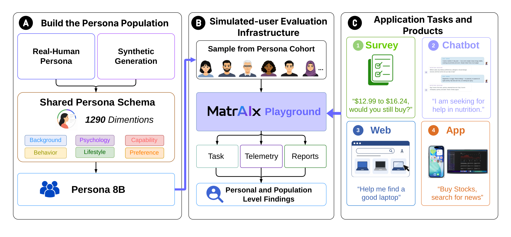

<div align="center">
  <h1>MatrAIx</h1>
  <p><strong>Simulate before reality.</strong></p>
  <p>
    Population-scale, persona-driven infrastructure for evaluating AI systems
    and interactive products with heterogeneous simulated users.
  </p>
  <p>
    <a href="https://matraix.ai/"></a>
    <a href="https://discord.gg/knVyQQnRFa"></a>
    <a href="https://x.com/MatrAIx2026"></a>
    <a href="https://www.linkedin.com/company/matraix"></a>
    <a href="https://forms.gle/hwEHng5HGWRqcJue9"></a>
    <a href="docs/README.md"></a>
    <a href="https://huggingface.co/datasets/MatrAIx2026/MatrAIx_Persona_1M_Public_Release"></a>
    <a href="LICENSE"></a>
    <a href="docs/quickstart.md#10-playground--play-tasks-visually"></a>
  </p>
</div>

<div align="center">
  <a href="https://www.youtube.com/watch?v=cNFkz9Wo1y4&t=15s">
    
  </a>
  <p>
    <a href="https://www.youtube.com/watch?v=cNFkz9Wo1y4&t=15s"></a>
  </p>
</div>

---

**MatrAIx** is a population-scale, persona-driven infrastructure for evaluating
AI systems and interactive products with heterogeneous simulated users. Instead
of testing against a generic or interchangeable user, MatrAIx instantiates
sampled persona records as LLM agents and runs them through reproducible tasks
across four environments — **Survey**, **AI Chatbot**, **Web**, and **App**
(native desktop and mobile, including macOS and iOS).

At its foundation is a shared schema of **1,290 categorical dimensions** covering
background, psychology, capability, and behavior. Personas combine
dependency-aware synthetic generation with evidence-aware human grounding; a
deterministic, quality-filtered coreset of **one million personas** is released
for research on
[Hugging Face](https://huggingface.co/datasets/MatrAIx2026/MatrAIx_Persona_1M_Public_Release).
Shared telemetry, task-owned verification, and reporting connect individual
responses and trajectories to subgroup- and population-level findings.

The name nods to *The Matrix*: a simulated world useful for exploration, stress
testing, and hypothesis generation, **not a replacement for evidence from real
people**.

## Requirements

- [Docker](https://docs.docker.com/get-docker/)
- [uv](https://docs.astral.sh/uv/) and Python 3.12
- Node.js 20+ (Playground / viewer frontends only)
- Model API keys for persona-agent examples — see [agents.md](docs/environment/agents.md)

## Installation

```bash
git clone <repo-url> && cd MatrAIx
uv venv --python 3.12
uv pip install -e .
uv pip install pytest pytest-asyncio httpx
uv pip install -e packages/playground
uv pip install -e packages/harbor-langsmith
uv pip install -e packages/rewardkit
```

All Matraix Playground commands run as **`uv run harbor …`**.

Set the model API key matching your provider before GUI or CLI task runs
(smoke test does not need one):

```bash
export ANTHROPIC_API_KEY="sk-ant-..."   # anthropic/claude-* models
# export OPENAI_API_KEY="sk-..."        # openai/gpt-* models
```

See [agents.md](docs/environment/agents.md) for the full key matrix.
Playground can also load keys from `application/playground/.env.local`.

### Import Persona 1M (optional)

```bash
huggingface-cli download MatrAIx2026/MatrAIx_Persona_1M_Public_Release \
  --repo-type dataset \
  --local-dir persona/datasets/matraix-persona-1m/release
```

Playground: Dataset → **`matraix-persona-1m`**. CLI: `--dataset persona/datasets/matraix-persona-1m`.
Details: [Handbook § Persona 1M](docs/README.md#3-persona-1m-optional).

## Quick start

### Smoke test

No API key required. **Requires Docker** (the smoke job uses
`environment.type: docker`):

```bash
uv run harbor run -c configs/jobs/example-job-recipe/harbor-smoke-local.yaml
```

### GUI task runs

Playground picks tasks, samples personas, and launches the same Matraix Playground jobs as CLI auto mode.
Start API + frontend (two terminals):

```bash
# Terminal A — API
VENV=.venv bash application/playground/backend/run_dev.sh

# Terminal B — frontend
cd application/playground/frontend && npm ci && npm run dev
```

Open **http://localhost:5173** → Playground → pick a persona cohort →
pick Survey / Chat / Web / OS app tasks → **Lock pipeline** → **Run eval**.
Details: [Playground §10](docs/quickstart.md#10-playground--play-tasks-visually).

### CLI task develop / runs

**Develop** — copy a reference task under `application/tasks/`, edit
`task.toml` / `instruction.md` / `input/` / verifier, then register it for Playground
([task-guide.md](docs/application/task-guide.md)):

```bash
cp -R application/tasks/example-survey_product-feedback \
  application/tasks/<your-task-name>
```

| Type | Reference task |
|------|----------------|
| Survey | `application/tasks/example-survey_product-feedback` |
| Chat | `application/tasks/example-chat-api_support_chatbot` |
| Web | `application/tasks/example-web-playwright_quote-choice` |
| OS-app | `application/tasks/example-computer-use-linux_note-to-csv` |

**Run** — generate a Matraix Playground job (pins agent + model), then execute it:

```bash
uv run python application/scripts/generate_application_job.py \
  --task application/tasks/example-survey_product-feedback \
  --execution-mode auto \
  --persona-ids 0042 \
  --model-name anthropic/claude-sonnet-4-6

# Use the export lines + recipe path the script prints, e.g.:
uv run harbor run -c configs/jobs/application-task-job-recipe/example-survey-product-feedback-auto-n1.yaml
```

Batch (`--sample-size N`), filters, and chat / web / os-app examples:
[docs/quickstart.md](docs/quickstart.md).

## Docs

**[MatrAIx Handbook](docs/README.md)** — guides, persona / application / environment docs.

<p align="center">
  
</p>

## Repository layout

```text
MatrAIx/
├── persona/                 Schema, datasets, synthesis/curation/validation pipelines
│   ├── schema/              1,290-dimension persona schema
│   ├── datasets/            Dev sample pool and persona YAMLs
│   ├── validation/          Grounding / quality validation suites
│   └── scripts/             Persona job & pipeline helpers
├── application/
│   ├── tasks/               Survey · chat · web · os-app task specs
│   ├── task-spec/           Shared task contracts
│   ├── playground/          Visual runner (backend API + frontend)
│   └── scripts/             generate_application_job.py and task tooling
├── environment/
│   ├── runtime/             Matraix Playground runtime
│   ├── agents/              Persona-conditioned agents
│   ├── task-environments/   Docker images / sidecars
│   └── adapters/            External adapters (e.g. SimpleQA)
├── packages/                playground · rewardkit · harbor-langsmith
├── apps/viewer/             Frontend paired with `harbor view`
├── configs/jobs/            Curated & generated Matraix Playground job recipes
├── docs/                    Handbook — persona/ · application/ · environment/
├── examples/                Minimal example tasks
├── src/matraix/             Python package entrypoints
├── scripts/                 Repo-level helpers
├── tests/                   Unit / environment tests
└── jobs/                    Local Matraix Playground run outputs (gitignored)
```

Large generated datasets stay outside git (see the Hugging Face release above).

## Join the Community

[](https://discord.gg/knVyQQnRFa)
[](https://x.com/MatrAIx2026)
[](https://www.linkedin.com/company/matraix)
[](https://forms.gle/hwEHng5HGWRqcJue9)

1. Join Discord — nickname **`Full Name - Affiliation`**. Fill the Google Form
   (background, interests, paper authorship / acknowledgements).
2. Say hi to us! We like to connect you for the shared interest or experience!
3. Participating MatrAIx research community for collaboration or contribution!

## License

MIT — see [LICENSE](LICENSE).
